# 📸 예나, 지금 (Yena, Now)

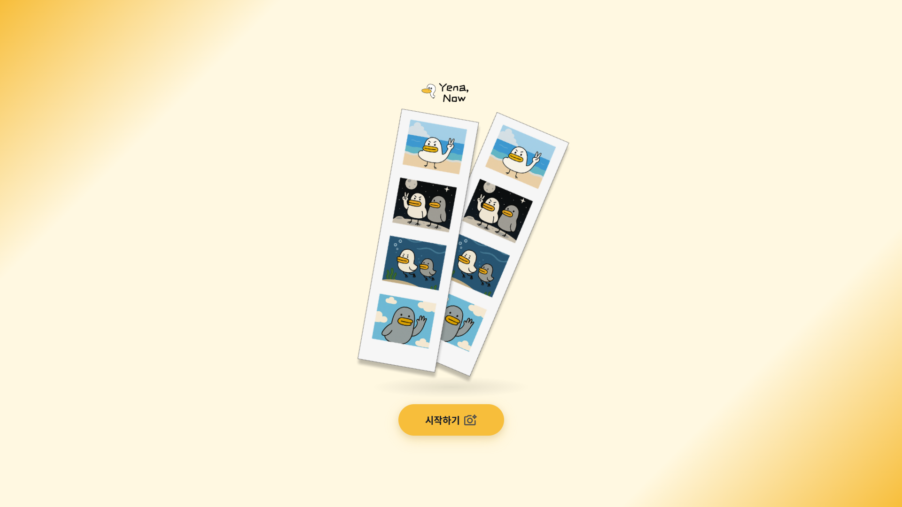

> 멀리 있어도, 함께 추억을 남길 수 있는 **온라인 포토부스 서비스**

**‘예나, 지금’** 은 친구, 가족, 연인과 시간과 장소에 구애 받지 않고 함께 N컷 사진이나 영상을 촬영하고 꾸미며 공유할 수 있는 온라인 포토부스 플랫폼입니다. <br/>
시공간의 제약 없이 소중한 사람들과 즐겁게 추억을 만들고 쉽게 공유할 수 있습니다.

<br/>

## ✨프로젝트 기간

2025.07.14 ~ 2025.08.18 (6주)

<br/>

## ✨팀원 소개

### 🧑‍💻 Front-end

| Name     | 임성룡                                                                | 김예나                                                                | 서연희                                                                |
| -------- | --------------------------------------------------------------------- | --------------------------------------------------------------------- | --------------------------------------------------------------------- |
| FE       |  |  |  |
| Position | Leader, 촬영·편집 페이지                                              | FE Leader, 로그인 상태 관리 도입, 어제/지난주의 순간 페이지           | 갤러리·프로필 페이지                                                  |
| Contact  | ryongseong.dev@gmail.com                                              | yeneua.dev@gmail.com                                                  | tjdusgml1219@naver.com                                                |

### 🧑‍💻 Back-end

| Name     | 김환수                                                                   | 박정훈                                                                | 전원균                                                                |
| -------- | ------------------------------------------------------------------------ | --------------------------------------------------------------------- | --------------------------------------------------------------------- |
| BE       | 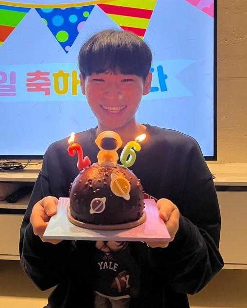    |  |  |
| Position | BE Leader, 인프라 및 CI/CD 파이프라인 구축, N컷 게시물·오픈비두 API 개발 | S3 연계 미디어 관리 기능 구현, 댓글·랭킹·촬영 에셋 등 조회 기능 개발  | 사용자 인증 및 FFmpeg 합성 기능 개발, 영상 포트폴리오 제작            |
| Contact  | skes01149@naver.com                                                      | qwg531@naver.com                                                      | spotydol7@gmail.com                                                   |

<br/>

## ✨핵심 기능

### 1. 실시간 동시 촬영

- 사진이나 영상을 실시간으로 촬영 가능 (카운트다운 지원)
- 사용자의 위치나 크기, 밝기 개별 조절 가능
- 원하는 배경 업로드, 필터, 컷 수, 촬영 횟수, 영상 촬영 시간 지정 가능
- 방 입장 시 자동으로 배경 제거

### 2. 실시간 동시 편집

- 프레임, 스티커, 텍스트로 N컷 꾸미기
- 실시간으로 편집 내용 반영

### 3. 갤러리

- 공개·팔로잉·나만보기 공개범위 지정 가능
- 좋아요·댓글로 반응 남기기
- 공개 갤러리와 친구 갤러리로 필터링된 갤러리

### 4. 어제의 순간/ 지난주의 순간

- 어제의 순간 : 전날 N컷 좋아요 수 기준으로 정렬
- 지난주의 순간 : 주간 하이라이트 좋아요 수 기준으로 정렬

## ✨기술 스택

### 🔧 Back-end

##### 개발 언어


##### 프레임워크

<svg role="img" viewBox="0 0 24 24" xmlns="http://www.w3.org/2000/svg"><title>Spring Boot</title><path d="m23.693 10.7058-4.73-8.1844c-.4094-.7106-1.4166-1.2942-2.2402-1.2942H7.2725c-.819 0-1.8308.5836-2.2402 1.2942L.307 10.7058c-.4095.7106-.4095 1.873 0 2.5837l4.7252 8.189c.4094.7107 1.4166 1.2943 2.2402 1.2943h9.455c.819 0 1.826-.5836 2.2402-1.2942l4.7252-8.189c.4095-.7107.4095-1.8732 0-2.5838zM10.9763 5.7547c0-.5365.4377-.9742.9742-.9742s.9742.4377.9742.9742v5.8217c0 .5366-.4377.9742-.9742.9742s-.9742-.4376-.9742-.9742zm.9742 12.4294c-3.6427 0-6.6077-2.965-6.6077-6.6077.0047-2.0896.993-4.0521 2.6685-5.304a.8657.8657 0 0 1 1.2142.1788.8657.8657 0 0 1-.1788 1.2143c-2.1602 1.6048-2.612 4.6592-1.0072 6.8194 1.6049 2.1603 4.6593 2.612 6.8195 1.0072 1.2378-.9177 1.9673-2.372 1.9673-3.9157a4.8972 4.8972 0 0 0-1.9861-3.925c-.386-.2824-.466-.8284-.1836-1.2143.2824-.386.8283-.466 1.2143-.1835 1.6895 1.2471 2.6826 3.2238 2.6873 5.3228 0 3.6474-2.965 6.6077-6.6077 6.6077z"/></svg>

##### DB


#### 인증방식


#### 미디어 처리


#### 문서화


#### 파일 저장


#### 데이터 접근


#### 보안


### 🔧 Front-end

##### 런타임 환경


##### 개발 언어


##### 라이브러리


##### 패키지 매니저


##### 빌드 툴


### 🔧 Infra

#### 클라우드


#### 컨테이너


#### 프록시


#### 운영 환경


#### CI/CD


## ✨프로젝트 폴더 구조

### Back-end

<details>
<summary>BE</summary>

```
BackEnd
 ┣ .gitlab
 ┃ ┗ merge_request_templates
 ┃ ┃ ┗ default.md
 ┣ .gradle
 ┃ ┣ 8.14.3
 ┃ ┃ ┣ checksums
 ┃ ┃ ┃ ┗ checksums.lock
 ┃ ┃ ┣ expanded
 ┃ ┃ ┣ fileChanges
 ┃ ┃ ┃ ┗ last-build.bin
 ┃ ┃ ┣ fileHashes
 ┃ ┃ ┃ ┣ fileHashes.bin
 ┃ ┃ ┃ ┗ fileHashes.lock
 ┃ ┃ ┣ vcsMetadata
 ┃ ┃ ┗ gc.properties
 ┃ ┣ buildOutputCleanup
 ┃ ┃ ┣ buildOutputCleanup.lock
 ┃ ┃ ┗ cache.properties
 ┃ ┗ vcs-1
 ┃ ┃ ┗ gc.properties
 ┣ .idea
 ┃ ┗ codeStyles
 ┃ ┃ ┗ codeStyleConfig.xml
 ┣ gradle
 ┃ ┗ wrapper
 ┃ ┃ ┣ gradle-wrapper.jar
 ┃ ┃ ┗ gradle-wrapper.properties
 ┣ src
 ┃ ┣ main
 ┃ ┃ ┣ java
 ┃ ┃ ┃ ┗ com
 ┃ ┃ ┃ ┃ ┗ example
 ┃ ┃ ┃ ┃ ┃ ┗ yenanow
 ┃ ┃ ┃ ┃ ┃ ┃ ┣ auth
 ┃ ┃ ┃ ┃ ┃ ┃ ┃ ┣ controller
 ┃ ┃ ┃ ┃ ┃ ┃ ┃ ┃ ┗ AuthController.java
 ┃ ┃ ┃ ┃ ┃ ┃ ┃ ┣ dto
 ┃ ┃ ┃ ┃ ┃ ┃ ┃ ┃ ┣ request
 ┃ ┃ ┃ ┃ ┃ ┃ ┃ ┃ ┃ ┣ ForgotPasswordRequest.java
 ┃ ┃ ┃ ┃ ┃ ┃ ┃ ┃ ┃ ┗ LoginRequest.java
 ┃ ┃ ┃ ┃ ┃ ┃ ┃ ┃ ┗ response
 ┃ ┃ ┃ ┃ ┃ ┃ ┃ ┃ ┃ ┣ LoginResponse.java
 ┃ ┃ ┃ ┃ ┃ ┃ ┃ ┃ ┃ ┗ ReissueTokenResponse.java
 ┃ ┃ ┃ ┃ ┃ ┃ ┃ ┣ oauth
 ┃ ┃ ┃ ┃ ┃ ┃ ┃ ┃ ┣ CustomOAuth2UserService.java
 ┃ ┃ ┃ ┃ ┃ ┃ ┃ ┃ ┗ OAuth2LoginSuccessHandler.java
 ┃ ┃ ┃ ┃ ┃ ┃ ┃ ┗ service
 ┃ ┃ ┃ ┃ ┃ ┃ ┃ ┃ ┣ AuthService.java
 ┃ ┃ ┃ ┃ ┃ ┃ ┃ ┃ ┗ AuthServiceImpl.java
 ┃ ┃ ┃ ┃ ┃ ┃ ┣ comment
 ┃ ┃ ┃ ┃ ┃ ┃ ┃ ┣ controller
 ┃ ┃ ┃ ┃ ┃ ┃ ┃ ┃ ┗ CommentController.java
 ┃ ┃ ┃ ┃ ┃ ┃ ┃ ┣ dto
 ┃ ┃ ┃ ┃ ┃ ┃ ┃ ┃ ┣ query
 ┃ ┃ ┃ ┃ ┃ ┃ ┃ ┃ ┃ ┗ CommentQueryDto.java
 ┃ ┃ ┃ ┃ ┃ ┃ ┃ ┃ ┣ request
 ┃ ┃ ┃ ┃ ┃ ┃ ┃ ┃ ┃ ┣ CommentCreateRequest.java
 ┃ ┃ ┃ ┃ ┃ ┃ ┃ ┃ ┃ ┗ CommentUpdateRequest.java
 ┃ ┃ ┃ ┃ ┃ ┃ ┃ ┃ ┗ response
 ┃ ┃ ┃ ┃ ┃ ┃ ┃ ┃ ┃ ┣ CommentListResponse.java
 ┃ ┃ ┃ ┃ ┃ ┃ ┃ ┃ ┃ ┗ CommentResponse.java
 ┃ ┃ ┃ ┃ ┃ ┃ ┃ ┣ entity
 ┃ ┃ ┃ ┃ ┃ ┃ ┃ ┃ ┗ Comment.java
 ┃ ┃ ┃ ┃ ┃ ┃ ┃ ┣ repository
 ┃ ┃ ┃ ┃ ┃ ┃ ┃ ┃ ┗ CommentRepository.java
 ┃ ┃ ┃ ┃ ┃ ┃ ┃ ┗ service
 ┃ ┃ ┃ ┃ ┃ ┃ ┃ ┃ ┣ CommentCountSyncService.java
 ┃ ┃ ┃ ┃ ┃ ┃ ┃ ┃ ┣ CommentService.java
 ┃ ┃ ┃ ┃ ┃ ┃ ┃ ┃ ┗ CommentServiceImpl.java
 ┃ ┃ ┃ ┃ ┃ ┃ ┣ common
 ┃ ┃ ┃ ┃ ┃ ┃ ┃ ┣ config
 ┃ ┃ ┃ ┃ ┃ ┃ ┃ ┃ ┣ cors
 ┃ ┃ ┃ ┃ ┃ ┃ ┃ ┃ ┃ ┣ CorsConfig.java
 ┃ ┃ ┃ ┃ ┃ ┃ ┃ ┃ ┃ ┗ CorsProperties.java
 ┃ ┃ ┃ ┃ ┃ ┃ ┃ ┃ ┣ AsyncConfig.java
 ┃ ┃ ┃ ┃ ┃ ┃ ┃ ┃ ┣ EmailConfig.java
 ┃ ┃ ┃ ┃ ┃ ┃ ┃ ┃ ┣ QuerydslConfig.java
 ┃ ┃ ┃ ┃ ┃ ┃ ┃ ┃ ┣ SecurityConfig.java
 ┃ ┃ ┃ ┃ ┃ ┃ ┃ ┃ ┗ SwaggerConfig.java
 ┃ ┃ ┃ ┃ ┃ ┃ ┃ ┣ exception
 ┃ ┃ ┃ ┃ ┃ ┃ ┃ ┃ ┣ BusinessException.java
 ┃ ┃ ┃ ┃ ┃ ┃ ┃ ┃ ┣ ErrorCode.java
 ┃ ┃ ┃ ┃ ┃ ┃ ┃ ┃ ┣ ErrorResponse.java
 ┃ ┃ ┃ ┃ ┃ ┃ ┃ ┃ ┗ GlobalExceptionHandler.java
 ┃ ┃ ┃ ┃ ┃ ┃ ┃ ┣ security
 ┃ ┃ ┃ ┃ ┃ ┃ ┃ ┃ ┣ CustomAuthenticationEntryPoint.java
 ┃ ┃ ┃ ┃ ┃ ┃ ┃ ┃ ┗ JwtAuthenticationFilter.java
 ┃ ┃ ┃ ┃ ┃ ┃ ┃ ┣ smtp
 ┃ ┃ ┃ ┃ ┃ ┃ ┃ ┃ ┣ request
 ┃ ┃ ┃ ┃ ┃ ┃ ┃ ┃ ┃ ┣ VerificationEmailRequest.java
 ┃ ┃ ┃ ┃ ┃ ┃ ┃ ┃ ┃ ┗ VerifyEmailRequest.java
 ┃ ┃ ┃ ┃ ┃ ┃ ┃ ┃ ┣ response
 ┃ ┃ ┃ ┃ ┃ ┃ ┃ ┃ ┃ ┗ VerifyEmailResponse.java
 ┃ ┃ ┃ ┃ ┃ ┃ ┃ ┃ ┣ MailService.java
 ┃ ┃ ┃ ┃ ┃ ┃ ┃ ┃ ┗ MailServiceImpl.java
 ┃ ┃ ┃ ┃ ┃ ┃ ┃ ┗ util
 ┃ ┃ ┃ ┃ ┃ ┃ ┃ ┃ ┣ CookieUtil.java
 ┃ ┃ ┃ ┃ ┃ ┃ ┃ ┃ ┣ JwtUtil.java
 ┃ ┃ ┃ ┃ ┃ ┃ ┃ ┃ ┗ UuidUtil.java
 ┃ ┃ ┃ ┃ ┃ ┃ ┣ film
 ┃ ┃ ┃ ┃ ┃ ┃ ┃ ┣ controller
 ┃ ┃ ┃ ┃ ┃ ┃ ┃ ┃ ┣ FfmpegController.java
 ┃ ┃ ┃ ┃ ┃ ┃ ┃ ┃ ┗ FilmController.java
 ┃ ┃ ┃ ┃ ┃ ┃ ┃ ┣ dto
 ┃ ┃ ┃ ┃ ┃ ┃ ┃ ┃ ┣ request
 ┃ ┃ ┃ ┃ ┃ ┃ ┃ ┃ ┃ ┣ MergeRequest.java
 ┃ ┃ ┃ ┃ ┃ ┃ ┃ ┃ ┃ ┗ MergeRequestItem.java
 ┃ ┃ ┃ ┃ ┃ ┃ ┃ ┃ ┗ response
 ┃ ┃ ┃ ┃ ┃ ┃ ┃ ┃ ┃ ┣ BackgroundListResponse.java
 ┃ ┃ ┃ ┃ ┃ ┃ ┃ ┃ ┃ ┣ FrameListResponse.java
 ┃ ┃ ┃ ┃ ┃ ┃ ┃ ┃ ┃ ┣ FrameListResponseItem.java
 ┃ ┃ ┃ ┃ ┃ ┃ ┃ ┃ ┃ ┣ MergeResponse.java
 ┃ ┃ ┃ ┃ ┃ ┃ ┃ ┃ ┃ ┣ StickerListResponse.java
 ┃ ┃ ┃ ┃ ┃ ┃ ┃ ┃ ┃ ┗ StickerListResponseItem.java
 ┃ ┃ ┃ ┃ ┃ ┃ ┃ ┣ entity
 ┃ ┃ ┃ ┃ ┃ ┃ ┃ ┃ ┣ Background.java
 ┃ ┃ ┃ ┃ ┃ ┃ ┃ ┃ ┣ Frame.java
 ┃ ┃ ┃ ┃ ┃ ┃ ┃ ┃ ┗ Sticker.java
 ┃ ┃ ┃ ┃ ┃ ┃ ┃ ┣ repository
 ┃ ┃ ┃ ┃ ┃ ┃ ┃ ┃ ┣ BackgroundRepository.java
 ┃ ┃ ┃ ┃ ┃ ┃ ┃ ┃ ┣ FrameRepository.java
 ┃ ┃ ┃ ┃ ┃ ┃ ┃ ┃ ┗ StickerRepository.java
 ┃ ┃ ┃ ┃ ┃ ┃ ┃ ┗ service
 ┃ ┃ ┃ ┃ ┃ ┃ ┃ ┃ ┣ FilmService.java
 ┃ ┃ ┃ ┃ ┃ ┃ ┃ ┃ ┗ FilmServiceImpl.java
 ┃ ┃ ┃ ┃ ┃ ┃ ┣ gallery
 ┃ ┃ ┃ ┃ ┃ ┃ ┃ ┣ controller
 ┃ ┃ ┃ ┃ ┃ ┃ ┃ ┃ ┣ GalleryController.java
 ┃ ┃ ┃ ┃ ┃ ┃ ┃ ┃ ┗ RankingController.java
 ┃ ┃ ┃ ┃ ┃ ┃ ┃ ┣ dto
 ┃ ┃ ┃ ┃ ┃ ┃ ┃ ┃ ┣ query
 ┃ ┃ ┃ ┃ ┃ ┃ ┃ ┃ ┃ ┗ LikeUserQueryDto.java
 ┃ ┃ ┃ ┃ ┃ ┃ ┃ ┃ ┣ request
 ┃ ┃ ┃ ┃ ┃ ┃ ┃ ┃ ┃ ┣ CreateNcutRelayRequest.java
 ┃ ┃ ┃ ┃ ┃ ┃ ┃ ┃ ┃ ┣ CreateNcutRequest.java
 ┃ ┃ ┃ ┃ ┃ ┃ ┃ ┃ ┃ ┣ CreateRelayNcutRequest.java
 ┃ ┃ ┃ ┃ ┃ ┃ ┃ ┃ ┃ ┣ CutItem.java
 ┃ ┃ ┃ ┃ ┃ ┃ ┃ ┃ ┃ ┣ ParticipantItem.java
 ┃ ┃ ┃ ┃ ┃ ┃ ┃ ┃ ┃ ┣ UpdateNcutContentRequest.java
 ┃ ┃ ┃ ┃ ┃ ┃ ┃ ┃ ┃ ┣ UpdateNcutVisibilityRequest.java
 ┃ ┃ ┃ ┃ ┃ ┃ ┃ ┃ ┃ ┣ UpdateRelayItem.java
 ┃ ┃ ┃ ┃ ┃ ┃ ┃ ┃ ┃ ┗ UpdateRelayRequest.java
 ┃ ┃ ┃ ┃ ┃ ┃ ┃ ┃ ┗ response
 ┃ ┃ ┃ ┃ ┃ ┃ ┃ ┃ ┃ ┣ MyGalleryResponse.java
 ┃ ┃ ┃ ┃ ┃ ┃ ┃ ┃ ┃ ┣ MyNcutResponse.java
 ┃ ┃ ┃ ┃ ┃ ┃ ┃ ┃ ┃ ┣ NcutDetailResponse.java
 ┃ ┃ ┃ ┃ ┃ ┃ ┃ ┃ ┃ ┣ NcutLikeResponse.java
 ┃ ┃ ┃ ┃ ┃ ┃ ┃ ┃ ┃ ┣ NcutLikesResponse.java
 ┃ ┃ ┃ ┃ ┃ ┃ ┃ ┃ ┃ ┣ NcutLikesResponseItem.java
 ┃ ┃ ┃ ┃ ┃ ┃ ┃ ┃ ┃ ┣ NcutRankingResponse.java
 ┃ ┃ ┃ ┃ ┃ ┃ ┃ ┃ ┃ ┣ NcutRelayListResponse.java
 ┃ ┃ ┃ ┃ ┃ ┃ ┃ ┃ ┃ ┣ RelayListItem.java
 ┃ ┃ ┃ ┃ ┃ ┃ ┃ ┃ ┃ ┣ RelayParticipantItem.java
 ┃ ┃ ┃ ┃ ┃ ┃ ┃ ┃ ┃ ┣ UpdateNcutContentResponse.java
 ┃ ┃ ┃ ┃ ┃ ┃ ┃ ┃ ┃ ┗ UpdateNcutVisibilityResponse.java
 ┃ ┃ ┃ ┃ ┃ ┃ ┃ ┣ entity
 ┃ ┃ ┃ ┃ ┃ ┃ ┃ ┃ ┣ Ncut.java
 ┃ ┃ ┃ ┃ ┃ ┃ ┃ ┃ ┣ NcutLike.java
 ┃ ┃ ┃ ┃ ┃ ┃ ┃ ┃ ┣ Relay.java
 ┃ ┃ ┃ ┃ ┃ ┃ ┃ ┃ ┣ RelayCut.java
 ┃ ┃ ┃ ┃ ┃ ┃ ┃ ┃ ┣ RelayParticipant.java
 ┃ ┃ ┃ ┃ ┃ ┃ ┃ ┃ ┗ Visibility.java
 ┃ ┃ ┃ ┃ ┃ ┃ ┃ ┣ repository
 ┃ ┃ ┃ ┃ ┃ ┃ ┃ ┃ ┣ NcutLikeQueryRepository.java
 ┃ ┃ ┃ ┃ ┃ ┃ ┃ ┃ ┣ NcutLikeQueryRepositoryImpl.java
 ┃ ┃ ┃ ┃ ┃ ┃ ┃ ┃ ┣ NcutLikeRepository.java
 ┃ ┃ ┃ ┃ ┃ ┃ ┃ ┃ ┣ NcutQueryRepository.java
 ┃ ┃ ┃ ┃ ┃ ┃ ┃ ┃ ┣ NcutQueryRepositoryImpl.java
 ┃ ┃ ┃ ┃ ┃ ┃ ┃ ┃ ┣ NcutRankingQueryRepository.java
 ┃ ┃ ┃ ┃ ┃ ┃ ┃ ┃ ┣ NcutRankingQueryRepositoryImpl.java
 ┃ ┃ ┃ ┃ ┃ ┃ ┃ ┃ ┣ NcutRepository.java
 ┃ ┃ ┃ ┃ ┃ ┃ ┃ ┃ ┣ RelayCutRepository.java
 ┃ ┃ ┃ ┃ ┃ ┃ ┃ ┃ ┣ RelayQueryRepository.java
 ┃ ┃ ┃ ┃ ┃ ┃ ┃ ┃ ┣ RelayQueryRepositoryImpl.java
 ┃ ┃ ┃ ┃ ┃ ┃ ┃ ┃ ┗ RelayRepository.java
 ┃ ┃ ┃ ┃ ┃ ┃ ┃ ┣ scheduler
 ┃ ┃ ┃ ┃ ┃ ┃ ┃ ┃ ┣ RankingScheduler.java
 ┃ ┃ ┃ ┃ ┃ ┃ ┃ ┃ ┗ RelayCleanupScheduler.java
 ┃ ┃ ┃ ┃ ┃ ┃ ┃ ┗ service
 ┃ ┃ ┃ ┃ ┃ ┃ ┃ ┃ ┣ GalleryService.java
 ┃ ┃ ┃ ┃ ┃ ┃ ┃ ┃ ┣ GalleryServiceImpl.java
 ┃ ┃ ┃ ┃ ┃ ┃ ┃ ┃ ┣ NcutCountSyncService.java
 ┃ ┃ ┃ ┃ ┃ ┃ ┃ ┃ ┣ RankingServiceRedis.java
 ┃ ┃ ┃ ┃ ┃ ┃ ┃ ┃ ┗ RankingServiceRedisImpl.java
 ┃ ┃ ┃ ┃ ┃ ┃ ┣ openvidu
 ┃ ┃ ┃ ┃ ┃ ┃ ┃ ┣ controller
 ┃ ┃ ┃ ┃ ┃ ┃ ┃ ┃ ┗ OpenviduController.java
 ┃ ┃ ┃ ┃ ┃ ┃ ┃ ┣ dto
 ┃ ┃ ┃ ┃ ┃ ┃ ┃ ┃ ┣ request
 ┃ ┃ ┃ ┃ ┃ ┃ ┃ ┃ ┃ ┣ CodeRequest.java
 ┃ ┃ ┃ ┃ ┃ ┃ ┃ ┃ ┃ ┣ TokenRelayRequest.java
 ┃ ┃ ┃ ┃ ┃ ┃ ┃ ┃ ┃ ┗ TokenRequest.java
 ┃ ┃ ┃ ┃ ┃ ┃ ┃ ┃ ┗ response
 ┃ ┃ ┃ ┃ ┃ ┃ ┃ ┃ ┃ ┣ CodeResponse.java
 ┃ ┃ ┃ ┃ ┃ ┃ ┃ ┃ ┃ ┗ TokenResponse.java
 ┃ ┃ ┃ ┃ ┃ ┃ ┃ ┗ service
 ┃ ┃ ┃ ┃ ┃ ┃ ┃ ┃ ┣ OpenviduService.java
 ┃ ┃ ┃ ┃ ┃ ┃ ┃ ┃ ┗ OpenviduServiceImpl.java
 ┃ ┃ ┃ ┃ ┃ ┃ ┣ s3
 ┃ ┃ ┃ ┃ ┃ ┃ ┃ ┣ config
 ┃ ┃ ┃ ┃ ┃ ┃ ┃ ┃ ┗ S3Config.java
 ┃ ┃ ┃ ┃ ┃ ┃ ┃ ┣ controller
 ┃ ┃ ┃ ┃ ┃ ┃ ┃ ┃ ┗ S3Controller.java
 ┃ ┃ ┃ ┃ ┃ ┃ ┃ ┣ dto
 ┃ ┃ ┃ ┃ ┃ ┃ ┃ ┃ ┣ request
 ┃ ┃ ┃ ┃ ┃ ┃ ┃ ┃ ┃ ┗ PresignedUrlRequest.java
 ┃ ┃ ┃ ┃ ┃ ┃ ┃ ┃ ┗ response
 ┃ ┃ ┃ ┃ ┃ ┃ ┃ ┃ ┃ ┗ PresignedUrlResponse.java
 ┃ ┃ ┃ ┃ ┃ ┃ ┃ ┣ service
 ┃ ┃ ┃ ┃ ┃ ┃ ┃ ┃ ┣ S3Service.java
 ┃ ┃ ┃ ┃ ┃ ┃ ┃ ┃ ┣ S3ServiceImpl.java
 ┃ ┃ ┃ ┃ ┃ ┃ ┃ ┃ ┗ UploadDbSaveService.java
 ┃ ┃ ┃ ┃ ┃ ┃ ┃ ┗ util
 ┃ ┃ ┃ ┃ ┃ ┃ ┃ ┃ ┗ S3KeyFactory.java
 ┃ ┃ ┃ ┃ ┃ ┃ ┣ users
 ┃ ┃ ┃ ┃ ┃ ┃ ┃ ┣ controller
 ┃ ┃ ┃ ┃ ┃ ┃ ┃ ┃ ┣ FollowController.java
 ┃ ┃ ┃ ┃ ┃ ┃ ┃ ┃ ┗ UsersController.java
 ┃ ┃ ┃ ┃ ┃ ┃ ┃ ┣ dto
 ┃ ┃ ┃ ┃ ┃ ┃ ┃ ┃ ┣ request
 ┃ ┃ ┃ ┃ ┃ ┃ ┃ ┃ ┃ ┣ NicknameRequest.java
 ┃ ┃ ┃ ┃ ┃ ┃ ┃ ┃ ┃ ┣ PresignedProfileRequest.java
 ┃ ┃ ┃ ┃ ┃ ┃ ┃ ┃ ┃ ┣ SignupRequest.java
 ┃ ┃ ┃ ┃ ┃ ┃ ┃ ┃ ┃ ┣ UpdateMyInfoRequest.java
 ┃ ┃ ┃ ┃ ┃ ┃ ┃ ┃ ┃ ┣ UpdatePasswordRequest.java
 ┃ ┃ ┃ ┃ ┃ ┃ ┃ ┃ ┃ ┗ UpdateProfileUrlRequest.java
 ┃ ┃ ┃ ┃ ┃ ┃ ┃ ┃ ┗ response
 ┃ ┃ ┃ ┃ ┃ ┃ ┃ ┃ ┃ ┣ FollowerResponse.java
 ┃ ┃ ┃ ┃ ┃ ┃ ┃ ┃ ┃ ┣ FollowerResponseItem.java
 ┃ ┃ ┃ ┃ ┃ ┃ ┃ ┃ ┃ ┣ FollowingResponse.java
 ┃ ┃ ┃ ┃ ┃ ┃ ┃ ┃ ┃ ┣ FollowingResponseItem.java
 ┃ ┃ ┃ ┃ ┃ ┃ ┃ ┃ ┃ ┣ MyInfoResponse.java
 ┃ ┃ ┃ ┃ ┃ ┃ ┃ ┃ ┃ ┣ NicknameResponse.java
 ┃ ┃ ┃ ┃ ┃ ┃ ┃ ┃ ┃ ┣ ProfileResponse.java
 ┃ ┃ ┃ ┃ ┃ ┃ ┃ ┃ ┃ ┣ SignupProfileUrlResponse.java
 ┃ ┃ ┃ ┃ ┃ ┃ ┃ ┃ ┃ ┣ SignupResponse.java
 ┃ ┃ ┃ ┃ ┃ ┃ ┃ ┃ ┃ ┣ UpdateProfileUrlResponse.java
 ┃ ┃ ┃ ┃ ┃ ┃ ┃ ┃ ┃ ┣ UserInviteSearchResponse.java
 ┃ ┃ ┃ ┃ ┃ ┃ ┃ ┃ ┃ ┣ UserInviteSearchResponseItem.java
 ┃ ┃ ┃ ┃ ┃ ┃ ┃ ┃ ┃ ┣ UserSearchResponse.java
 ┃ ┃ ┃ ┃ ┃ ┃ ┃ ┃ ┃ ┗ UserSearchResponseItem.java
 ┃ ┃ ┃ ┃ ┃ ┃ ┃ ┣ entity
 ┃ ┃ ┃ ┃ ┃ ┃ ┃ ┃ ┣ Follow.java
 ┃ ┃ ┃ ┃ ┃ ┃ ┃ ┃ ┣ Gender.java
 ┃ ┃ ┃ ┃ ┃ ┃ ┃ ┃ ┗ User.java
 ┃ ┃ ┃ ┃ ┃ ┃ ┃ ┣ repository
 ┃ ┃ ┃ ┃ ┃ ┃ ┃ ┃ ┣ FollowQueryRepository.java
 ┃ ┃ ┃ ┃ ┃ ┃ ┃ ┃ ┣ FollowQueryRepositoryImpl.java
 ┃ ┃ ┃ ┃ ┃ ┃ ┃ ┃ ┣ FollowRepository.java
 ┃ ┃ ┃ ┃ ┃ ┃ ┃ ┃ ┣ UserQueryRepository.java
 ┃ ┃ ┃ ┃ ┃ ┃ ┃ ┃ ┣ UserQueryRepositoryImpl.java
 ┃ ┃ ┃ ┃ ┃ ┃ ┃ ┃ ┗ UserRepository.java
 ┃ ┃ ┃ ┃ ┃ ┃ ┃ ┗ service
 ┃ ┃ ┃ ┃ ┃ ┃ ┃ ┃ ┣ FollowCountSyncService.java
 ┃ ┃ ┃ ┃ ┃ ┃ ┃ ┃ ┣ FollowService.java
 ┃ ┃ ┃ ┃ ┃ ┃ ┃ ┃ ┣ FollowServiceImpl.java
 ┃ ┃ ┃ ┃ ┃ ┃ ┃ ┃ ┣ UserService.java
 ┃ ┃ ┃ ┃ ┃ ┃ ┃ ┃ ┗ UserServiceImpl.java
 ┃ ┃ ┃ ┃ ┃ ┃ ┗ YenanowApplication.java
 ┃ ┃ ┗ resources
 ┃ ┃ ┃ ┗ application.properties
 ┃ ┗ test
 ┃ ┃ ┗ java
 ┃ ┃ ┃ ┗ com
 ┃ ┃ ┃ ┃ ┗ example
 ┃ ┃ ┃ ┃ ┃ ┗ yenanow
 ┃ ┃ ┃ ┃ ┃ ┃ ┗ YenanowApplicationTests.java
 ┣ .gitattributes
 ┣ .gitignore
 ┣ build.gradle
 ┣ Dockerfile
 ┣ gradlew
 ┣ gradlew.bat
 ┣ Jenkinsfile
 ┣ README.md
 ┗ settings.gradle
```

</details>

### Front-end

<details>
<summary>FE</summary>

```
FrontEnd
 ┣ .gitlab
 ┃ ┗ merge_request_templates
 ┃ ┃ ┗ default.md
 ┣ public
 ┃ ┣ header_logo.png
 ┃ ┣ logo.png
 ┃ ┗ user_default_profile.png
 ┣ src
 ┃ ┣ api
 ┃ ┃ ┣ auth.ts
 ┃ ┃ ┣ client.ts
 ┃ ┃ ┣ comment.ts
 ┃ ┃ ┣ gallerylist.ts
 ┃ ┃ ┣ like.ts
 ┃ ┃ ┣ moment.ts
 ┃ ┃ ┣ ncut.ts
 ┃ ┃ ┣ ncutdetail.ts
 ┃ ┃ ┣ profile.ts
 ┃ ┃ ┣ s3.ts
 ┃ ┃ ┣ search.ts
 ┃ ┃ ┗ user.ts
 ┃ ┣ assets
 ┃ ┃ ┗ Landing
 ┃ ┃ ┃ ┣ landing_photo.png
 ┃ ┃ ┃ ┗ photo.svg
 ┃ ┣ components
 ┃ ┃ ┣ Common
 ┃ ┃ ┃ ┣ Button.tsx
 ┃ ┃ ┃ ┣ FollowModal.tsx
 ┃ ┃ ┃ ┣ GalleryCard.tsx
 ┃ ┃ ┃ ┣ Input.tsx
 ┃ ┃ ┃ ┣ LoadingSpinner.tsx
 ┃ ┃ ┃ ┣ Logo.tsx
 ┃ ┃ ┃ ┣ OptionModal.tsx
 ┃ ┃ ┃ ┣ ProfileImage.tsx
 ┃ ┃ ┃ ┗ SearchModal.tsx
 ┃ ┃ ┣ Gallery
 ┃ ┃ ┃ ┣ GalleryList.tsx
 ┃ ┃ ┃ ┗ GalleryTabMenu.tsx
 ┃ ┃ ┣ GalleryDetail
 ┃ ┃ ┃ ┣ CommentSection.tsx
 ┃ ┃ ┃ ┣ DeletePostContent.tsx
 ┃ ┃ ┃ ┣ DownloadButton.tsx
 ┃ ┃ ┃ ┣ DownloadMenu.tsx
 ┃ ┃ ┃ ┣ LikeButton.tsx
 ┃ ┃ ┃ ┣ LikeListModal.tsx
 ┃ ┃ ┃ ┣ PhotoSection.tsx
 ┃ ┃ ┃ ┣ PostEditButton.tsx
 ┃ ┃ ┃ ┣ PostEditMenu.tsx
 ┃ ┃ ┃ ┣ PostSection.tsx
 ┃ ┃ ┃ ┣ ShareButton.tsx
 ┃ ┃ ┃ ┣ ShareModalContent.tsx
 ┃ ┃ ┃ ┣ UserInfo.tsx
 ┃ ┃ ┃ ┣ VisibilityEditContent.tsx
 ┃ ┃ ┃ ┗ VisibilityIcon.tsx
 ┃ ┃ ┣ Header
 ┃ ┃ ┃ ┗ Header.tsx
 ┃ ┃ ┣ Moment
 ┃ ┃ ┃ ┣ MomentCut.tsx
 ┃ ┃ ┃ ┗ MomentLayout.tsx
 ┃ ┃ ┣ MyProfile
 ┃ ┃ ┃ ┣ ProfileEdit.tsx
 ┃ ┃ ┃ ┗ ProfileView.tsx
 ┃ ┃ ┣ NCut
 ┃ ┃ ┃ ┣ Create
 ┃ ┃ ┃ ┃ ┣ Fifth.tsx
 ┃ ┃ ┃ ┃ ┣ First.tsx
 ┃ ┃ ┃ ┃ ┣ Fourth.tsx
 ┃ ┃ ┃ ┃ ┣ Last.tsx
 ┃ ┃ ┃ ┃ ┣ Second.tsx
 ┃ ┃ ┃ ┃ ┗ Third.tsx
 ┃ ┃ ┃ ┣ Edit
 ┃ ┃ ┃ ┃ ┣ DecorateNCut.tsx
 ┃ ┃ ┃ ┃ ┣ Saving.tsx
 ┃ ┃ ┃ ┃ ┣ SelectCuts.tsx
 ┃ ┃ ┃ ┃ ┗ SelectFrame.tsx
 ┃ ┃ ┃ ┣ Enter
 ┃ ┃ ┃ ┃ ┗ EnterConfirmModal.tsx
 ┃ ┃ ┃ ┣ Chat.tsx
 ┃ ┃ ┃ ┣ LoadingScreen.tsx
 ┃ ┃ ┃ ┣ NCutBackground.tsx
 ┃ ┃ ┃ ┗ SessionPrompt.tsx
 ┃ ┃ ┗ UserProfile
 ┃ ┃ ┃ ┗ ProfileHeader.tsx
 ┃ ┣ hooks
 ┃ ┃ ┣ useBackgroundRemoval.tsx
 ┃ ┃ ┣ useDragAndDrop.tsx
 ┃ ┃ ┣ useRoom.tsx
 ┃ ┃ ┗ useToast.tsx
 ┃ ┣ pages
 ┃ ┃ ┣ Auth
 ┃ ┃ ┃ ┣ Login.tsx
 ┃ ┃ ┃ ┣ ResetPassword.tsx
 ┃ ┃ ┃ ┣ Signup.tsx
 ┃ ┃ ┃ ┣ SignupMore.tsx
 ┃ ┃ ┃ ┗ SocialCallback.tsx
 ┃ ┃ ┣ Gallery
 ┃ ┃ ┃ ┣ Gallery.tsx
 ┃ ┃ ┃ ┗ GalleryDetail.tsx
 ┃ ┃ ┣ Landing
 ┃ ┃ ┃ ┗ Landing.tsx
 ┃ ┃ ┣ MyProfile
 ┃ ┃ ┃ ┣ ChangePassword.tsx
 ┃ ┃ ┃ ┗ MyProfileInfo.tsx
 ┃ ┃ ┣ NCut
 ┃ ┃ ┃ ┣ CreateSession.tsx
 ┃ ┃ ┃ ┣ EditNCut.tsx
 ┃ ┃ ┃ ┣ NCutMain.tsx
 ┃ ┃ ┃ ┣ ParticipationSession.tsx
 ┃ ┃ ┃ ┗ Session.tsx
 ┃ ┃ ┣ UserProfile
 ┃ ┃ ┃ ┗ UserProfile.tsx
 ┃ ┃ ┗ Moment.tsx
 ┃ ┣ store
 ┃ ┃ ┗ authStore.ts
 ┃ ┣ styles
 ┃ ┃ ┣ components
 ┃ ┃ ┃ ┣ Common
 ┃ ┃ ┃ ┃ ┣ ButtonStyle.ts
 ┃ ┃ ┃ ┃ ┣ FollowModalStyle.ts
 ┃ ┃ ┃ ┃ ┣ GalleryCardStyle.ts
 ┃ ┃ ┃ ┃ ┣ GalleryTabMenu.ts
 ┃ ┃ ┃ ┃ ┣ InputStyle.ts
 ┃ ┃ ┃ ┃ ┣ LoadingStyle.ts
 ┃ ┃ ┃ ┃ ┣ LogoStyle.ts
 ┃ ┃ ┃ ┃ ┣ OptionModalStyle.ts
 ┃ ┃ ┃ ┃ ┣ ProfileImageStyle.ts
 ┃ ┃ ┃ ┃ ┗ SearchModalStyle.ts
 ┃ ┃ ┃ ┣ Gallery
 ┃ ┃ ┃ ┃ ┗ GalleryStyle.ts
 ┃ ┃ ┃ ┣ GalleryDetail
 ┃ ┃ ┃ ┃ ┣ CommentStyle.ts
 ┃ ┃ ┃ ┃ ┣ DeletePostContentStyle.ts
 ┃ ┃ ┃ ┃ ┣ DownloadButtonStyle.ts
 ┃ ┃ ┃ ┃ ┣ DownloadMenuStyle.ts
 ┃ ┃ ┃ ┃ ┣ LikeButtonStyle.ts
 ┃ ┃ ┃ ┃ ┣ LikeListModalStyle.ts
 ┃ ┃ ┃ ┃ ┣ PhotoSectionStyle.ts
 ┃ ┃ ┃ ┃ ┣ PostEditButtonStyle.ts
 ┃ ┃ ┃ ┃ ┣ PostEditMenuStyle.ts
 ┃ ┃ ┃ ┃ ┣ PostSectionStyle.ts
 ┃ ┃ ┃ ┃ ┣ ShareButtonStyle.ts
 ┃ ┃ ┃ ┃ ┣ ShareModalContentStyle.ts
 ┃ ┃ ┃ ┃ ┣ UserInfoStyle.ts
 ┃ ┃ ┃ ┃ ┗ VisibilityEditContentStyle.ts
 ┃ ┃ ┃ ┣ Header
 ┃ ┃ ┃ ┃ ┗ HeaderStyle.ts
 ┃ ┃ ┃ ┣ Moment
 ┃ ┃ ┃ ┃ ┣ MomentCutStyle.ts
 ┃ ┃ ┃ ┃ ┗ MomentLayoutStyle.ts
 ┃ ┃ ┃ ┣ MyProfile
 ┃ ┃ ┃ ┃ ┣ ProfileEditStyle.ts
 ┃ ┃ ┃ ┃ ┗ ProfileViewStyle.ts
 ┃ ┃ ┃ ┣ NCut
 ┃ ┃ ┃ ┃ ┣ Create
 ┃ ┃ ┃ ┃ ┃ ┣ FifthStyle.ts
 ┃ ┃ ┃ ┃ ┃ ┣ FirstStyle.ts
 ┃ ┃ ┃ ┃ ┃ ┣ GlobalStyle.ts
 ┃ ┃ ┃ ┃ ┃ ┣ LastStyle.ts
 ┃ ┃ ┃ ┃ ┃ ┣ SecondStyle.ts
 ┃ ┃ ┃ ┃ ┃ ┗ ThirdStyle.ts
 ┃ ┃ ┃ ┃ ┣ Edit
 ┃ ┃ ┃ ┃ ┃ ┣ DecorateNCutStyle.ts
 ┃ ┃ ┃ ┃ ┃ ┣ SavingStyle.ts
 ┃ ┃ ┃ ┃ ┃ ┣ SelectCutsStyle.ts
 ┃ ┃ ┃ ┃ ┃ ┗ SelectFrameStyle.ts
 ┃ ┃ ┃ ┃ ┣ Enter
 ┃ ┃ ┃ ┃ ┃ ┗ EnterModalStyle.ts
 ┃ ┃ ┃ ┃ ┣ BackgroundStyle.ts
 ┃ ┃ ┃ ┃ ┣ ChatStyle.ts
 ┃ ┃ ┃ ┃ ┣ LoadingScreenStyle.ts
 ┃ ┃ ┃ ┃ ┗ SessionPromptStyle.ts
 ┃ ┃ ┃ ┗ UserProfile
 ┃ ┃ ┃ ┃ ┗ ProfileHeaderStyle.ts
 ┃ ┃ ┣ hooks
 ┃ ┃ ┃ ┗ ToastStyles.ts
 ┃ ┃ ┣ pages
 ┃ ┃ ┃ ┣ Auth
 ┃ ┃ ┃ ┃ ┣ AuthGlobalStyle.ts
 ┃ ┃ ┃ ┃ ┣ LoginStyle.ts
 ┃ ┃ ┃ ┃ ┗ SignupMoreStyle.ts
 ┃ ┃ ┃ ┣ Gallery
 ┃ ┃ ┃ ┃ ┣ GalleryDetailStyle.ts
 ┃ ┃ ┃ ┃ ┣ GalleryListStyle.ts
 ┃ ┃ ┃ ┃ ┗ LoadingSpinnerStyle.ts
 ┃ ┃ ┃ ┣ Landing
 ┃ ┃ ┃ ┃ ┗ LandingStyle.ts
 ┃ ┃ ┃ ┣ Moment
 ┃ ┃ ┃ ┃ ┗ MomentStyle.ts
 ┃ ┃ ┃ ┣ MyProfile
 ┃ ┃ ┃ ┃ ┗ ChangePasswordStyle.ts
 ┃ ┃ ┃ ┗ NCut
 ┃ ┃ ┃ ┃ ┣ EditNCutStyle.ts
 ┃ ┃ ┃ ┃ ┣ NCutMainStyle.ts
 ┃ ┃ ┃ ┃ ┣ ParticipationSessionStyle.ts
 ┃ ┃ ┃ ┃ ┗ SessionStyle.ts
 ┃ ┃ ┗ GlobalStyle.ts
 ┃ ┣ types
 ┃ ┃ ┣ auth.ts
 ┃ ┃ ┣ ButtonType.ts
 ┃ ┃ ┣ Chat.ts
 ┃ ┃ ┣ Comment.ts
 ┃ ┃ ┣ Like.ts
 ┃ ┃ ┣ moment.ts
 ┃ ┃ ┣ ncut.ts
 ┃ ┃ ┣ NCutDetail.ts
 ┃ ┃ ┣ NCutList.ts
 ┃ ┃ ┣ Profile.ts
 ┃ ┃ ┣ s3.ts
 ┃ ┃ ┣ Session.ts
 ┃ ┃ ┣ User.ts
 ┃ ┃ ┣ UserList.ts
 ┃ ┃ ┗ UserSearchModal.ts
 ┃ ┣ utils
 ┃ ┃ ┣ date.ts
 ┃ ┃ ┗ validators.ts
 ┃ ┣ App.tsx
 ┃ ┣ main.tsx
 ┃ ┗ vite-env.d.ts
 ┣ .dockerignore
 ┣ .env.development
 ┣ .gitignore
 ┣ .prettierignore
 ┣ .prettierrc
 ┣ Dockerfile
 ┣ eslint.config.js
 ┣ index.html
 ┣ Jenkinsfile
 ┣ nginx.conf
 ┣ package.json
 ┣ README.md
 ┣ tsconfig.app.json
 ┣ tsconfig.json
 ┣ tsconfig.node.json
 ┣ tsconfig.paths.json
 ┣ vite.config.ts
 ┗ yarn.lock
```

</details>

## ✨프로젝트 산출물

- [요구사항정의서](https://www.notion.so/230cff49c3b6804a8d1eebec5af0bd99)
- [기능명세서](https://www.notion.so/234cff49c3b680708e12eface29f4bee)
- [와이어프레임](https://www.notion.so/232cff49c3b6806287c3d618195853c5)
- [API명세서](https://www.notion.so/API-22bcff49c3b680feb90fcd40c8fb0b06)
- [ERD](./Docs/ERD.md)
- [아키텍처](./Docs/아키텍처.md)

## ✨프로젝트 결과물

- [포팅매뉴얼](https://www.notion.so/251cff49c3b6805c8088de0e95792cdd)
- [중간발표자료](https://www.notion.so/250cff49c3b68080b690e9b2b11a0395)
- [최종발표자료](./Docs/assets/발표%20피피티.pptx)

## ✨화면 구성

### 랜딩 페이지


### 로그인

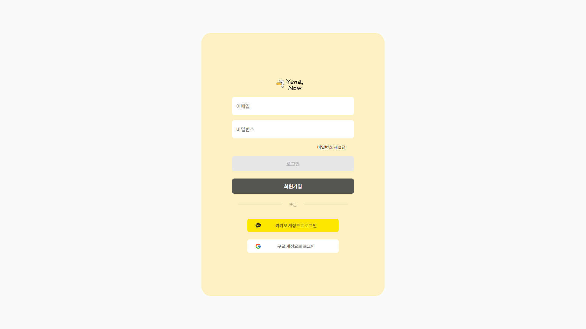

- 소셜 로그인(카카오, 구글) 가능

### 회원가입

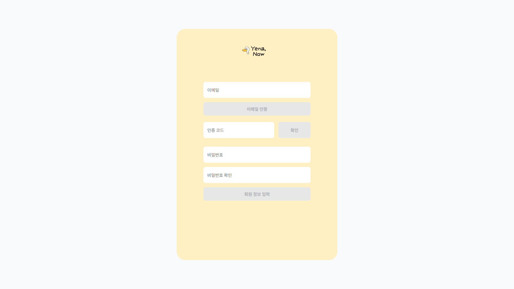

- 이메일 인증 후 가입

### 정보기입

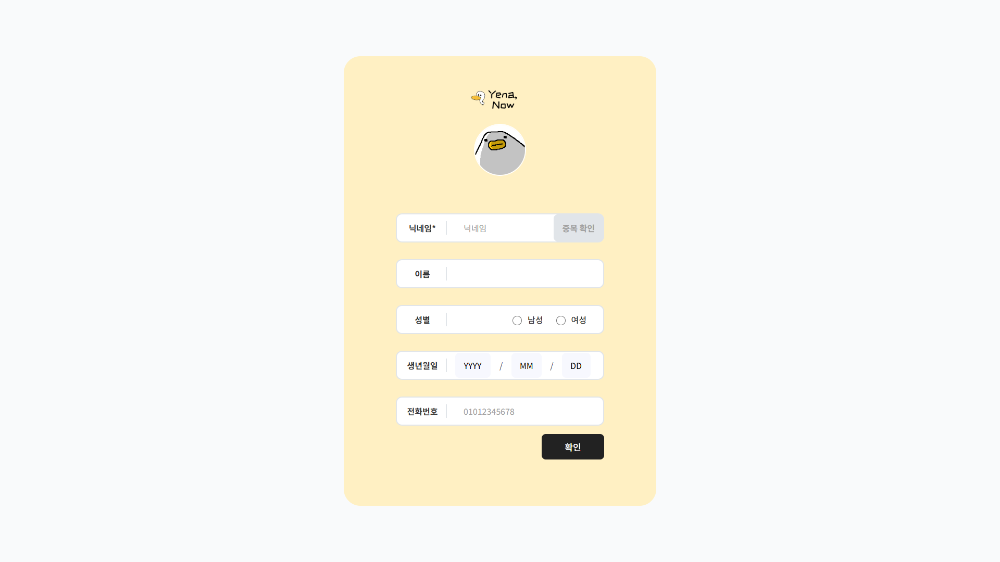

- 닉네임 필수 기입

### 방생성

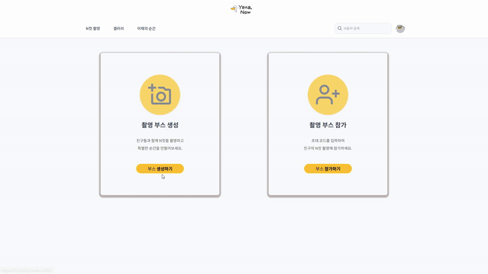

- 원하는 배경 등록, 필터, 컷 수, 촬영 횟수, 영상 촬영 시간 지정 가능

### 방입장

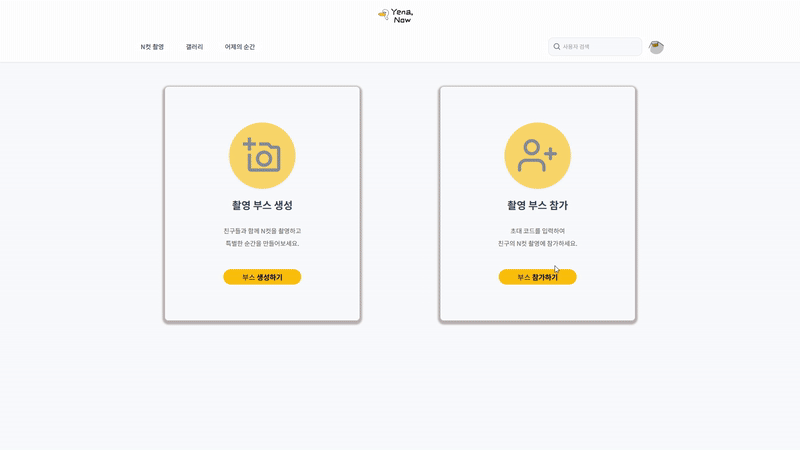

- 방 코드 입력 후 입장 가능

### N컷 촬영


- 크기, 위치, 밝기 개별 조절 가능
- 타이머 제공, 영상 촬영 시 남은 시간 제공
- 채팅 가능
- 실시간 대화 가능

### 편집


- 실시간 편집 반영
- 프레임, 스티커, 텍스트로 꾸미기 가능

### 갤러리 - 공개

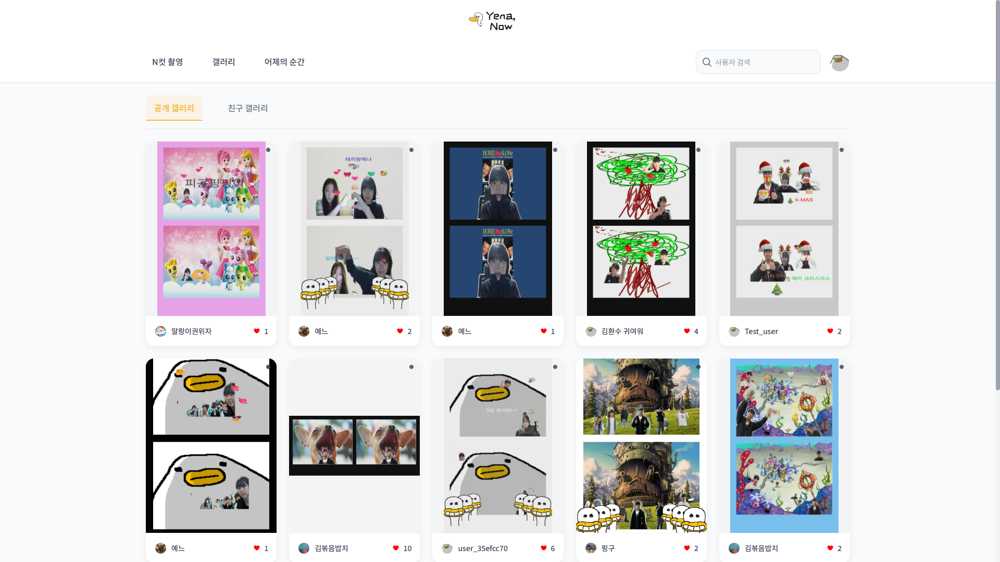

### 갤러리 - 친구

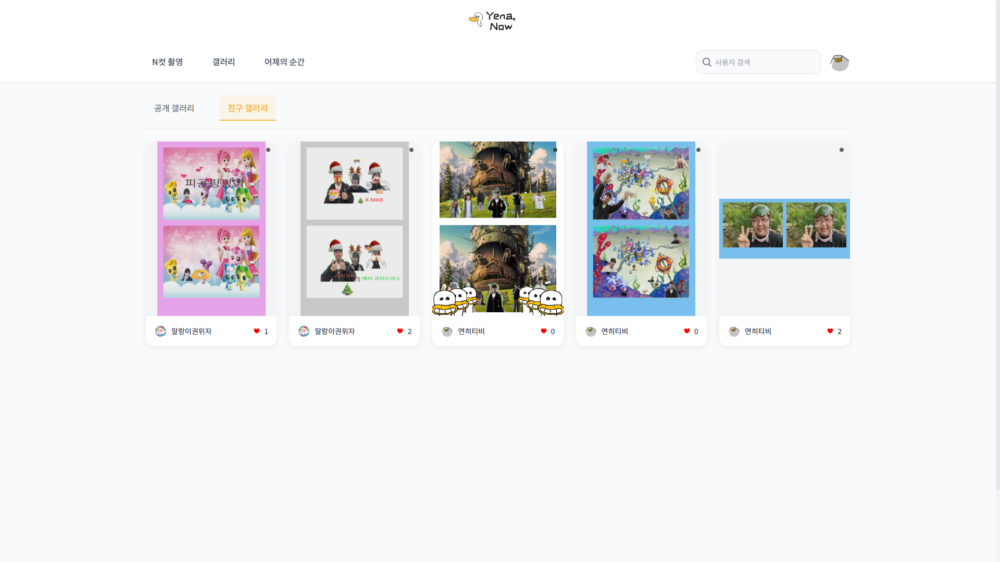

- 팔로잉 한 유저의 N컷만 보여짐

### 갤러리 상세


- 좋아요, 댓글로 반응
- N컷 공유 가능
- 나의 N컷 다운로드, 글 수정, 공개범위 수정, 타인 댓글 삭제 가능

### 어제/지난주의 순간

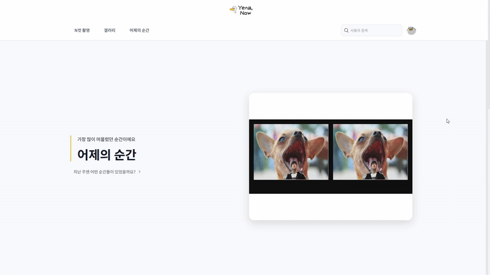

- 어제/ 지난주의 N컷을 좋아요가 높은 순으로 볼 수 있음

### 사용자 검색


- 사용자 검색 후 프로필 이동

### 내 프로필

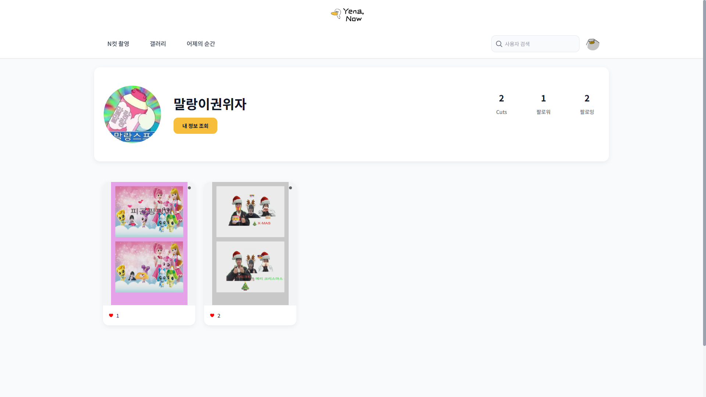

- 나의 N컷 확인 가능, 내 정보 조회가능
- 팔로워, 팔로잉 확인 가능

### 타인 프로필

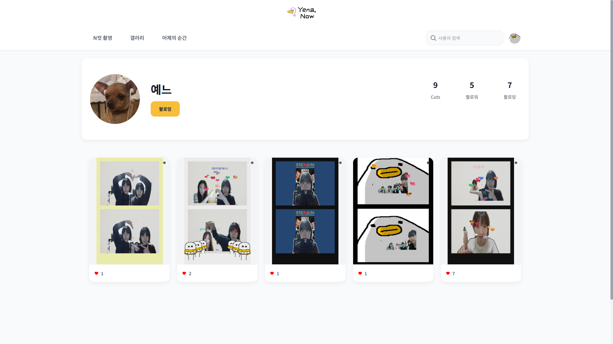

- 유저의 공개 범위가 전체공개인 N컷 확인 가능
- 팔로우, 언팔로우 가능
- 팔로워, 팔로잉 확인 가능

### 정보조회

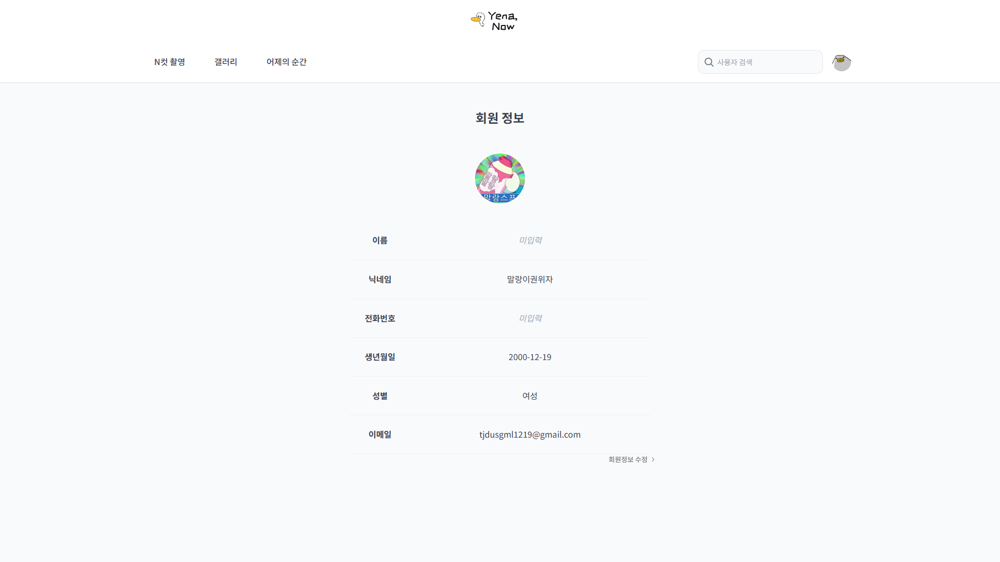

### 정보수정

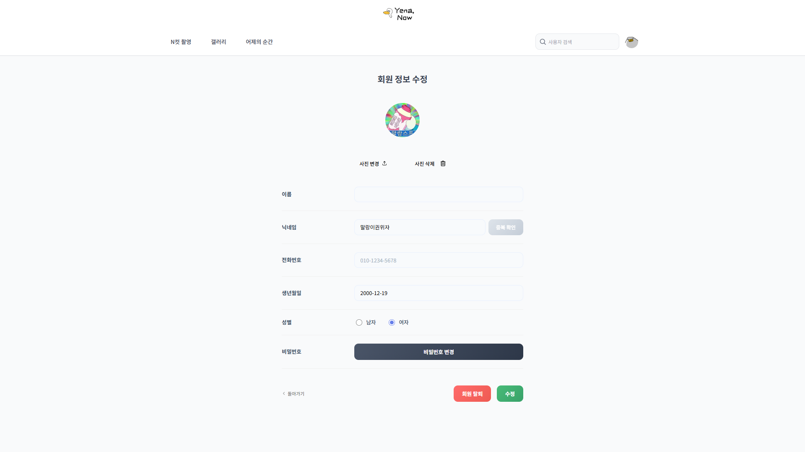

- 나의 정보 수정 및 회원 탈퇴

### 비밀번호 변경


